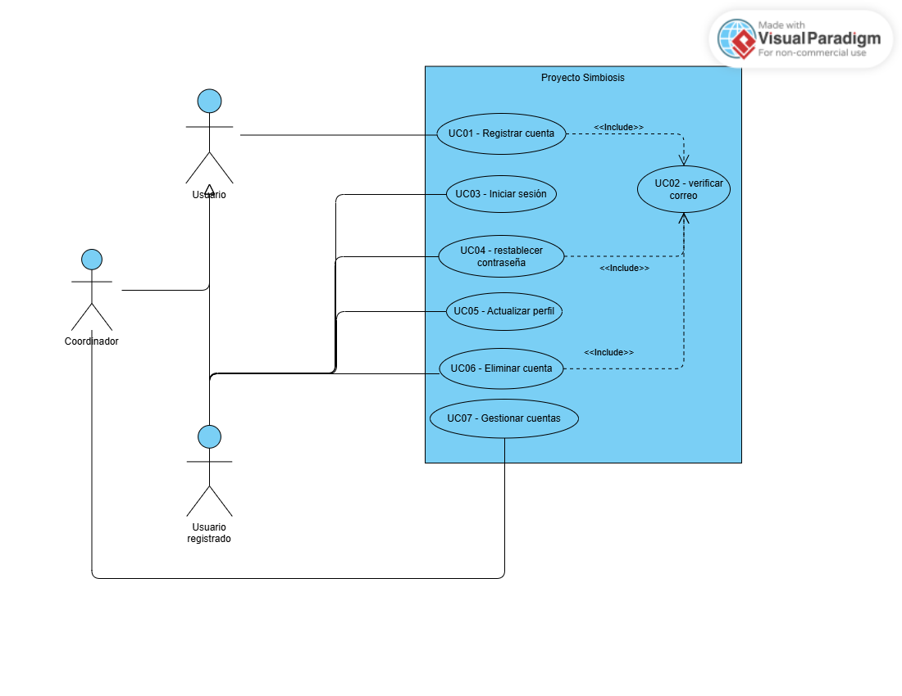

# Modelo de casos de uso de Proyecto Simbiosis

| Versión | Fecha | Estado |
| --- | --- | --- |
| 1.3 | 05/10/2026 | Borrador |

**Iteración de referencia:** E1

Este documento recoge el modelo de casos de uso del proyecto. Se completa a medida que se incorporan funciones. Los diagramas muestran distintas vistas del mismo modelo.

## 1 Alcance del modelo

En E1 el modelo representa la primera vista funcional de Proyecto Simbiosis, centrada en el acceso local, la gestión básica de cuentas y la ayuda y bienvenida. El alcance se corresponde con las funciones seleccionadas en el apartado 4 del [plan de E1](../planificacion/plan-iteracion-e1.md).

La vista incluye el registro local, la verificación del correo, el inicio de sesión, la recuperación o restablecimiento de contraseña como función de requisitos, la actualización del perfil, la eliminación de la cuenta propia, la gestión básica de cuentas por parte del coordinador, la aprobación de perfiles profesionales, la gestión de las condiciones de acceso y la autorización de relaciones de cuidado. También representa la ayuda contextual y el recorrido de bienvenida.

El modelo distingue la verificación del correo de la aprobación de un perfil profesional y de la autorización de una relación de cuidado. Estas condiciones no se consideran equivalentes.

En E1 el modelo es parcial. Quedan pendientes la autenticación y vinculación con Google, la aplicación del alias en espacios públicos, la ayuda específica de recetas, foro, valoraciones y comentarios, las funciones avanzadas de ayuda, las acciones de moderación por infracciones, el ciclo de finalización de relaciones de cuidado y otras funciones de salud, recetas, foro, publicaciones y moderación.

La primera vista no implica que todas las funciones representadas estén implementadas en el prototipo. El prototipo de E1 cubre únicamente los escenarios técnicos definidos en el plan de iteración.

## 2 Actores

| Nombre del actor | Rol que representa |
| --- | --- |
| Usuario | Persona que interactúa con Proyecto Simbiosis |
| Usuario registrado | Persona que dispone de una cuenta en la plataforma |
| Coordinador | Persona que gestiona cuentas y aprobaciones desde las funciones de administración |

Usuario registrado es una especialización de Usuario. Disponer de una cuenta no significa haber iniciado sesión.

El coordinador representa un rol externo del sistema y no corresponde a una persona concreta del equipo de desarrollo.

## 3 Casos de uso

| Identificador | Nombre | Objetivo | Participantes |
| --- | --- | --- | --- |
| UC-01 | Registrar cuenta | Crear una cuenta local proporcionando los datos requeridos y aceptando las condiciones correspondientes | Actor principal: Usuario.|
| UC-02 | Verificar correo | Confirmar la dirección de correo de una cuenta mediante el enlace recibido | Actor principal: Usuario |
| UC-03 | Iniciar sesión | Acceder a la plataforma mediante las credenciales de una cuenta local | Actor principal: Usuario registrado |
| UC-04 | Restablecer contraseña | Recuperar el acceso mediante un enlace enviado al correo de la cuenta | Actor principal: Usuario registrado.|
| UC-05 | Actualizar perfil | Actualizar los datos personales y preferencias permitidos | Actor principal: Usuario registrado |
| UC-06 | Eliminar cuenta propia | Solicitar la eliminación de la cuenta propia tras comprobar la identidad | Actor principal: Usuario registrado |
| UC-07 | Gestionar cuentas | Consultar y gestionar las cuentas según las funciones de administración previstas | Actor principal: Coordinador |
| UC-08 | Aprobar perfil profesional | Aprobar una solicitud de perfil profesional después de revisar la documentación requerida | Actor principal: Coordinador |
| UC-09 | Gestionar relación de cuidado | Gestionar la activación de una relación de cuidado conforme a la autorización del paciente | Actor principal: Usuario registrado |
| UC-10 | Consultar ayuda | Consultar instrucciones y contenidos de ayuda relacionados con las funciones disponibles | Actor principal: Usuario |
| UC-11 | Realizar bienvenida | Mostrar el recorrido de bienvenida durante el primer acceso | Actor principal: Usuario registrado |

Los casos de uso representan objetivos funcionales y no corresponden necesariamente uno a uno con los FR del catálogo.

La gestión de cuentas incluye las acciones de listado, aprobación, suspensión, eliminación y registro de auditoría previstas en E1. Las diferencias entre estas acciones se desarrollarán en las descripciones de los casos de uso cuando se trabajen con mayor profundidad.

La autorización de una relación de cuidado se mantiene diferenciada de la verificación del correo y de la aprobación de un perfil profesional.

## 4 Diagramas del modelo

### 4.1 Primera vista

**Título:** Acceso, cuentas y ayuda

**Alcance:** Representa los casos de uso seleccionados para E1 relacionados con el registro y acceso local, la gestión básica de cuentas, los perfiles y relaciones de cuidado, y la ayuda y bienvenida.

La vista utiliza la misma frontera del sistema para todos los casos representados. La autenticación mediante Google y las funciones todavía aplazadas no forman parte de esta vista.

La relación entre verificación del correo, aprobación profesional y autorización de cuidado se mantiene explícita para evitar tratarlas como una única condición de acceso.

## 5 Respaldo en los requisitos

| Elemento del modelo | UR y FR de referencia | NFR pertinentes | Relación con los requisitos |
| --- | --- | --- | --- |
| UC-01 Registrar cuenta | UR-01; FR-001, FR-002, FR-003, FR-004, FR-005, FR-007, FR-008, FR-009, FR-010, FR-011, FR-012, FR-013, FR-188, FR-189, FR-214, FR-215 | NFR-010, NFR-003, NFR-014 | Representa el registro local, sus datos y validaciones, el alias, CAPTCHA, aceptación independiente de condiciones y privacidad, y las condiciones de idioma y accesibilidad previstas para E1. |
| UC-02 Verificar correo | UR-01; FR-008, FR-009 | NFR-003, NFR-004, NFR-005 | La cuenta permanece pendiente hasta que se verifica el correo. La verificación es diferente de la aprobación de un perfil y de la autorización de una relación de cuidado. |
| UC-03 Iniciar sesión | UR-02; FR-015 | NFR-004, NFR-005, NFR-010, NFR-003, NFR-014 | Representa el acceso local mediante correo y contraseña. E1 medirá el inicio de sesión del prototipo bajo la carga definida para la comprobación. |
| UC-04 Restablecer contraseña | UR-02; FR-016 | NFR-010, NFR-003, NFR-014 | Representa el restablecimiento mediante un enlace enviado al correo de la cuenta. La función forma parte del alcance de requisitos de E1, aunque no se implementa en el prototipo. |
| UC-05 Actualizar perfil | UR-03; FR-019 | NFR-010, NFR-003, NFR-014 | FR-019 permite modificar datos personales y preferencias, pero excluye alias y correo. La función debe respetar las condiciones de accesibilidad e idioma. |
| UC-06 Eliminar cuenta propia | UR-03; FR-020, FR-211 | NFR-010 | La eliminación propia exige comprobar la identidad mediante la contraseña actual. El contenido publicado por un cuidador se conserva cuando corresponde. La función forma parte de los requisitos de E1, pero no del prototipo. |
| UC-07 Gestionar cuentas | UR-13; FR-181, FR-182, FR-183, FR-184, FR-185, FR-211, FR-212 | NFR-010 | Representa el listado y las acciones de gestión de cuentas previstas para el coordinador, incluida la auditoría. La eliminación de una cuenta de cuidador debe conservar su contenido según los requisitos. |
| UC-08 Aprobar perfil profesional | UR-01, UR-13; FR-014, FR-191, FR-213 | NFR-010 | La solicitud de perfil de nutricionista incluye documentación profesional en PDF y sus comprobaciones. Las funciones profesionales permanecen limitadas mientras la documentación no sea aprobada. |
| UC-09 Gestionar relación de cuidado | UR-01; FR-193, FR-194 | NFR-010 | La relación de cuidado requiere autorización expresa del paciente. La autorización no se considera equivalente a la verificación del correo ni a la aprobación de un perfil profesional. |
| UC-10 Consultar ayuda | UR-12; FR-172, FR-173 (parte correspondiente a E1), FR-174, FR-175, FR-176, FR-177 | NFR-010, NFR-003, NFR-014 | Representa la ayuda sobre las funciones seleccionadas, con navegación entre temas, elementos visuales y posibilidad de pausar, reanudar y cerrar. |
| UC-11 Realizar bienvenida | UR-12; FR-207 | NFR-010, NFR-003, NFR-014 | Representa el recorrido de bienvenida del primer acceso. Puede omitirse y es independiente de la ayuda contextual. |

Los NFR se incorporan como condiciones del modelo cuando afectan al comportamiento o a las características de las funciones. No se crea un caso de uso independiente para cada NFR.

NFR-004 define la carga de referencia de 100 usuarios concurrentes y 10 operaciones por segundo durante 30 minutos. NFR-005 establece un máximo de 2 segundos para el 95 % de los inicios de sesión y de las consultas definidas para la prueba. En E1 la comprobación se limita al inicio de sesión.

La relación de NFR-005 con FR concretos sigue pendiente en el catálogo. E1 comprobará su aplicación al acceso local sin modificar la trazabilidad canónica.

El catálogo no contiene un NFR específico de seguridad de credenciales. Esta cuestión queda pendiente de aclaración y no se presenta como requisito confirmado.

## 6 Descripciones de los casos de uso

**Desarrollo posterior.** Este apartado queda pendiente en E1. El plan de iteración establece que E1 construye el modelo y precisa los escenarios necesarios, pero no exige descripciones detalladas de los casos de uso.

Las descripciones se completarán en iteraciones posteriores, conservando los identificadores definidos en el apartado 3.

## 7 Continuidad entre iteraciones

E1 constituye la primera vista del modelo de casos de uso. La vista inicial cubre acceso local, gestión básica de cuentas, perfiles y relaciones de cuidado seleccionadas, ayuda y bienvenida.

En las siguientes iteraciones se incorporarán nuevas vistas para las funciones que quedan pendientes, entre ellas Google, salud, recetas, foro, publicaciones, valoraciones, comentarios y moderación. También podrán ampliarse las vistas actuales cuando se trabajen funciones avanzadas de ayuda, suspensión, expulsión y ciclo de vida de las relaciones de cuidado.

Los elementos que continúen representando el mismo objetivo conservarán sus identificadores. Las revisiones de comportamiento no implicarán crear un nuevo identificador cuando el objetivo del caso de uso siga siendo el mismo.

La arquitectura y las pruebas pueden aportar evidencias que obliguen a revisar el modelo. La primera vista no se considera definitiva ni implica que los módulos de usuarios y ayuda estén completados.

El historial completo de este archivo está en Git. Para localizar el estado de cierre de una iteración, se utilizará el commit identificado al cerrar esa iteración.
